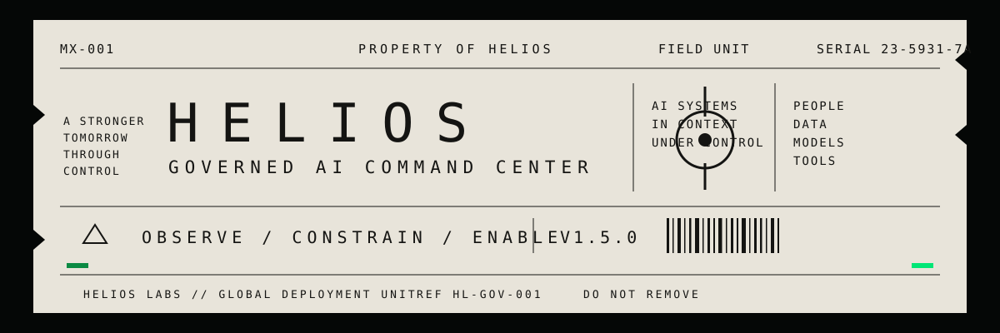
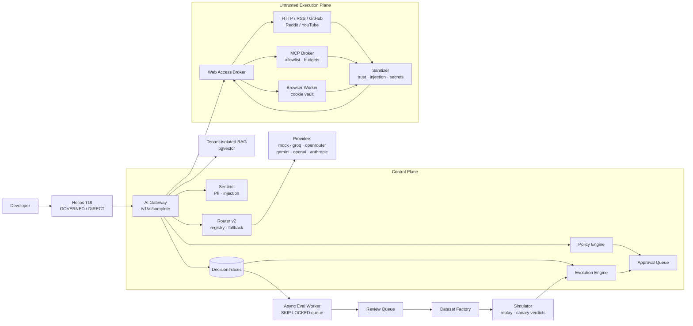
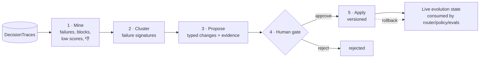
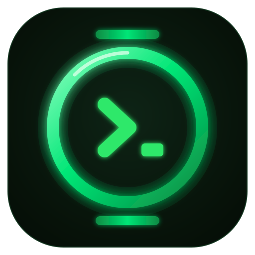

<div align="center">



<br/><br/>


<br/><br/>

**One governed AI runtime. Multiple enterprise workflows.**
A terminal-first AI agent that can use any model, any OpenAI-compatible gateway,
and any approved tool — while recording, evaluating, and governing every meaningful action.
Domain workspaces (Engineering · Software · Finance) run on the same runtime:
*the domain changes, the governance does not.*

[Quick start](#-quick-start) ·
[Workspaces & workflows](#-domain-workspaces--governed-workflows) ·
[Terminal agent](#-terminal-first-agent-interface) ·
[Gateways](#-universal-gateway-connectivity) ·
[Web access](#-governed-web-access) ·
[Actions & approvals](#-agent-actions-approvals-and-idempotency) ·
[Self-evolution](#-self-evolving-agents) ·
[Security](#-security-model) ·
[Results](#-measured-results) ·
[Docs](#-documentation)

</div>

---

## Why Helios

Every AI platform can call a model. Almost none can answer the questions that
matter in production: **what did the agent actually do, why was it allowed,
what did it cost, was the answer grounded, and who approved the risky part?**

Helios is an enterprise AI command center built governance-first, then wrapped
in a developer experience that feels like a modern coding agent:

- **Every decision is a trace.** Model calls, retrievals, policy verdicts,
  routing chains, web fetches, MCP calls, browser events, approvals — one
  auditable record per decision, tenant-isolated.
- **Policy gates actions, not just text.** Write operations are typed,
  approval-bound to an exact payload hash, and idempotent. Web content is
  evidence, never authority.
- **The system improves itself — under human control.** Helios mines its own
  failures into typed improvement proposals with evidence, and a human holds
  the apply/rollback gate.
- **Zero-ceremony local start.** SQLite + mock providers run the entire
  platform — all 83 tests, the API, the worker, and the TUI — with no
  external services and no API keys.

## At a glance

| | |
|---|---|
| 🏭 **Domain workspaces** | Engineering, Software, Finance packs on one workflow engine: sources → deterministic analysis → grounded reasoning → evidence → risk → approval → trace |
| 🖥️ **Terminal agent** | GOVERNED / DIRECT modes, 26-gateway catalog, dynamic model discovery, `/workspace` + `/workflow`, `/web` research, `/approvals`, `/evolve` |
| 🛡️ **Safety plane** | PII redaction, prompt-injection quarantine (inputs, RAG docs, web pages, MCP results), policy-as-code, blocked-decision traces |
| 🌐 **Web access broker** | Policy preflight → adapter fallback → sanitization → provenance; failure honesty is structural |
| 🔌 **MCP governance** | Trust lifecycle, tool allowlists, per-call budgets, version pinning with drift detection |
| 🍪 **Browser sessions** | Encrypted cookie vault (fail-closed), per-session domain allowlists, event audit, approval-gated authenticated reads |
| ✅ **Approvals & idempotency** | Typed action registry, payload-hash-bound approvals, effect journal — retries replay, never re-execute |
| 🧬 **Self-evolution** | Failure mining → clustered evidence → typed proposals → human gate → versioned apply + rollback |
| 📊 **Quality loop** | Async evaluation, groundedness scoring, human review queue, dataset factory, traffic-replay simulator |

## Architecture



Design rule inherited from the spec: **visibility first**, then evaluation,
grounding, safety, optimization, continuous improvement — and now
self-improvement, gated by humans.

## Platform matrix

| Pillar | Capabilities | Status |
|---|---|---|
| **AI Gateway** | Unified `/v1/ai/complete`, API-key auth, tenant/app model, request normalization, cost + latency metering, error traces | ✅ shipped |
| **Decision traces** | Full request/response/policy/routing/eval persistence, tenant-isolated `/v1/traces` | ✅ shipped |
| **Async evaluation** | Postgres `FOR UPDATE SKIP LOCKED` queue, horizontally-scalable workers, heuristic evaluators | ✅ shipped |
| **Grounded RAG** | pgvector, single-transaction ingestion, tenant isolation *before* distance calc, citations, poisoned-doc defense | ✅ shipped |
| **Safety (Sentinel + policy)** | PII detect/redact, injection detection, output leak scans, policy-as-code preflight & output gates | ✅ shipped |
| **Routing** | Model registry, explainable decisions, ordered fallback chains, cost guardrails | ✅ shipped |
| **Quality loop** | Groundedness/hallucination scoring, review queue, feedback, dataset lineage (`v1 → v2`), traffic-replay simulator | ✅ shipped |
| **Knowledge graph** | Typed entity extraction, dedup, `mentioned_in` provenance, traversal API | ✅ shipped |
| **Terminal agent (TUI)** | GOVERNED/DIRECT modes, gateway catalog, `/models` discovery, web research, approvals, evolution | ✅ shipped |
| **Web access — read path** | Broker, policy preflight, 6 adapters, sanitization, per-source failure honesty, audit jobs | ✅ shipped (W1) |
| **MCP governance** | Server registration, trust lifecycle, tool filtering, budgets, version-drift detection | ✅ shipped (W2) |
| **Browser sessions** | Encrypted vault, domain allowlists, event audit, approval-gated authenticated reads (read-only) | ✅ shipped (W3) |
| **Actions & approvals** | Typed registry, payload-bound approvals, idempotent effect journal, scheduled research watches | ✅ shipped (W4) |
| **Self-evolution** | Failure mining (incl. workflow failures), clustering, typed proposals, human gate, versioned apply/rollback | ✅ shipped |
| **Workflow engine** | Reusable governed pipeline: sources → deterministic analysis → RAG → reasoning → evidence → risk → approval → trace; explicit `insufficient_evidence` | ✅ shipped |
| **Domain workspaces** | Engineering, Software Engineering, Finance/Operations packs — configuration-driven, synthetic demo data, `make demo` | ✅ shipped |
| **Enterprise track** | Kafka/ClickHouse, OPA, Neo4j, SSO/OIDC + RBAC, SDKs, streaming, K8s | 🗺️ [roadmap](docs/YC27_TECHNICAL_CHECKLIST.md) |

## 🚀 Quick start

### Docker (Postgres + API + workers)

```bash
docker compose up --build          # pgvector Postgres + API + eval worker
make seed                          # prints a fresh API key
KEY=<paste-key> make curl-complete
```

### Local (SQLite, zero services, zero API keys)

```bash
export HELIOS_DATABASE_URL="sqlite:////tmp/helios.sqlite3"
export PYTHONPATH=src
python -m helios.cli create-api-key --tenant acme --app support   # prints a key
python -m uvicorn helios.main:app --reload
```

```bash
curl -s -X POST http://localhost:8000/v1/ai/complete \
  -H "X-Helios-API-Key: $KEY" -H "Content-Type: application/json" \
  -d '{"input": "Hello Project Helios"}'
```

Interactive API docs: `http://localhost:8000/docs` · Tests:
`PYTHONPATH=src python -m pytest -q` → **83 passed in ~2s**, fully offline.

## 🏭 Domain workspaces & governed workflows

> **One governed AI runtime. Multiple enterprise workflows.**
> **The domain changes. The governance does not.**

The workflow layer adapts Helios to different enterprise domains without a
separate AI architecture per industry. Three reference workspaces (all
**synthetic demo data**) run on one engine:

| Workspace | Workflows | Deterministic core |
|---|---|---|
| **Engineering** | test-run comparison · incident investigation · daily brief · knowledge assistant | parameter deltas, threshold violations, anomaly flags, incident correlation |
| **Software Engineering** | deployment-failure investigation · release risk analysis · daily brief | commit diffs between deploys, CI error extraction, incident-prone-service checks |
| **Finance / Operations** | invoice compliance review · operations brief | procurement-policy rule checks, duplicate detection, aggregation (no payment actions exist) |

Every execution follows the same pipeline through the **existing** governance
stack — Sentinel, policy, router, traces, evaluation, approvals, idempotent
actions:

```text
SOURCES → DETERMINISTIC ANALYSIS → WORKSPACE-SCOPED RAG → AI REASONING
   → EVIDENCE + PROVENANCE → RISK CLASSIFICATION → POLICY
   → HUMAN APPROVAL (when required) → TYPED ACTION → DECISION TRACE
```

The architecture strictly separates **COMPUTED FACT** (deterministic code:
`max_temp_c: 48.2 → 61.3, +27.18%`) from **AI INTERPRETATION** (grounded in
the facts block) from **RECOMMENDATION** (config-driven risk rules + approval
gates). No sources → explicit `insufficient_evidence`, confidence 0.0, no AI
call — never fabrication. The engine contains zero industry conditionals
(enforced by a test); adding a domain is a configuration pack, not a core
change.

```bash
make demo    # seeds all three workspaces + runs one workflow each (synthetic data)
```

```text
helios:auto ❯ /workspace use engineering
helios:auto ❯ /workflow run test_run_comparison run_a=104 run_b=105
GOVERNED
  WORKSPACE : ENGINEERING      RISK      : HIGH
  WORKFLOW  : TEST_RUN_COMPARISON
  TRACE     : 4264edad-…       EVIDENCE  : 14 SOURCES
  STATUS    : COMPLETED        CONFIDENCE: 0.9
  APPROVAL  : REQUIRED
  fact max_temp_c: 48.2 -> 61.3 (+13.1 abs, +27.18%)
  fact cooling_flow_lpm: 14.2 -> 8.9 (-5.3 abs, -37.32%)
  fact max_temp_c=61.3 above_max limit 60.0; cooling_flow_lpm=8.9 below_min limit 10.0
```

Full guide — workspace/workflow/source/evidence models, risk & approval
model, how to add a domain: [docs/WORKFLOWS.md](docs/WORKFLOWS.md).

## 🖥️ Terminal-first agent interface

A fast, agent-centric REPL — not an API administration panel. The governed
route is always visibly marked **GOVERNED**; direct gateways are marked
**DIRECT** so you know exactly when Helios governance is bypassed.

```bash
export HELIOS_API_KEY="<key from make seed>"
PYTHONPATH=src python -m helios.tui --gateway helios     # or: make tui
```

```text
Helios — terminal agent interface
Gateway helios [GOVERNED] — /help for commands

helios:auto ❯ /web search complaints about product X
Sources
  ✓ reddit        ok · 12 results
  ⚠ x             rate_limited · upstream 429
  ✓ github        ok · 9 results
Evidence
  [1] Example discussion
      reddit · untrusted_external_content · retrieved 2026-08-26T12:03
job=9f2c…  · 21 documents

helios:auto ❯ /evolve
  a5a87be5  [routing_fallback] Demote provider 'unknown' after 3 failures
           evidence: 3 traces

helios:auto ❯ /evolve apply a5a87be5
a5a87be5 -> applied (v1)
```

| Command group | Commands |
|---|---|
| Session | `/help` `/status` `/clear` `/quit` |
| Models & gateways | `/gateway` `/connect` `/model` `/models` `/refresh` |
| Workspaces | `/workspace list\|use\|status` `/workflow list\|run\|history` `/brief` `/evidence` |
| Web research | `/web sources` `/web status` `/web search` `/web read` `/web transcript` |
| Governance | `/approvals` `/approve <id>` `/deny <id>` |
| Self-evolution | `/evolve` `/evolve list` `/evolve apply <id>` |

Every governed turn prints its `trace_id`, model, cost, latency, and citation
count. `Ctrl+K` focuses the prompt, `Ctrl+L` clears the screen, `Ctrl+C` exits.

## 🔌 Universal gateway connectivity

A data-driven catalog of **26 gateways** — hosted providers, aggregators,
enterprise gateways, and local runtimes — plus unlimited custom profiles.
When a gateway exposes `GET /models`, `/refresh` discovers its live model
list instead of trusting a hard-coded one.

| | |
|---|---|
| **Hosted** | OpenAI · OpenRouter · Groq · Together · Fireworks · DeepInfra · Hyperbolic · NVIDIA · Cerebras · SambaNova · DeepSeek · Mistral · xAI · Cohere · Perplexity · Hugging Face · Cloudflare |
| **Aggregators** | LiteLLM · Portkey |
| **Local** | Ollama · LM Studio · vLLM · llama.cpp · SGLang · LocalAI |
| **Governed** | `helios` — the default; traces, policy, routing, evaluation preserved |

Custom gateways store **only the environment-variable name** of a credential —
`gateway-add` rejects anything that looks like a raw secret:

```bash
PYTHONPATH=src python -m helios.cli gateway-add my-gateway \
  --base-url https://gateway.example.com/v1 \
  --api-key-env MY_GATEWAY_API_KEY --model my-model

PYTHONPATH=src python -m helios.cli gateway-list
PYTHONPATH=src python -m helios.tui --gateway my-gateway
```

Free-tier providers for real completions: [Groq](https://console.groq.com/keys)
(`HELIOS_GROQ_API_KEY`), [OpenRouter](https://openrouter.ai/keys)
(`HELIOS_OPENROUTER_API_KEY`), [Gemini](https://aistudio.google.com/apikey)
(`HELIOS_GEMINI_API_KEY`) — free tiers are metered at $0.00. The `mock`
provider needs nothing at all.

## 🌐 Governed web access

> **Core rule: web content is data, never authority.** A page, transcript,
> post, tool description, or MCP response must never change Helios policy,
> credentials, or tool permissions.

Every web operation flows through the **Web Access Broker**:
policy preflight → adapter fallback chain → sanitization → normalized
documents with provenance → tenant-scoped `WebAccessJob` audit records.

```bash
curl -s -X POST http://localhost:8000/v1/web/search \
  -H "X-Helios-API-Key: $KEY" -H "Content-Type: application/json" \
  -d '{"query": "complaints about product X"}'
```

| Control | Enforcement (all tested) |
|---|---|
| Trust labeling | Every document is forced to `untrusted_external_content` — adapters cannot upgrade trust |
| Injection quarantine | Sentinel patterns scan pages/transcripts/posts/MCP results; poisoned content is withheld |
| Secret scrubbing | API keys, bearer tokens, cookies, JWTs are redacted before return or persistence |
| Read/write separation | Write ops (post/send/delete/like/follow/purchase) are refused without approval |
| Domain policy | Reads restricted to an allowlist; unknown domains blocked with an explicit reason |
| Failure honesty | Rate-limited sources reported as such; fallbacks visible; retrieval never fabricated |
| Optional connectors | Agent-Reach (MCP) & SocialCrawl report `unconfigured` honestly; MCP tools allowlisted |

Adapters: public HTTP/RSS reader · GitHub (typed API ops, no shell) · Reddit ·
YouTube transcripts (public captions, no `yt-dlp` shell) · Agent-Reach ·
SocialCrawl. Full design: [docs/WEB_ACCESS_ARCHITECTURE.md](docs/WEB_ACCESS_ARCHITECTURE.md).

### MCP governance (Phase W2)

Arbitrary MCP servers never run inside the API process. Registered servers
start **untrusted** and are unusable until a human approves them; every call
is tool-filtered, argument-validated, budgeted (calls/bytes/timeout), and
sanitized. The version pinned at registration is checked at health time —
drift marks the server degraded instead of silently changing tool behavior.

```text
POST /v1/mcp/servers            register (starts untrusted)
POST /v1/mcp/servers/{id}/trust approve | revoke
GET  /v1/mcp/servers/{id}/health  reachability + version drift
POST /v1/mcp/call               governed tool call → sanitized document
```

### Browser sessions (Phase W3, read-only)

Cookies live **only** in an encrypted session vault (`HELIOS_SESSION_VAULT_KEY`,
fail-closed — no key, no sessions). The worker decrypts them per request,
attaches them to the outbound call, and they never appear in responses,
events, traces, or prompts. Fresh context is the default; authenticated reads
additionally require an approval bound to the exact `(url, session)` payload.
Every navigation emits `navigate` / `read` / `blocked` audit events.

## ✅ Agent actions, approvals, and idempotency

Phase W4 makes writing to the outside world a **typed, human-gated, exactly-once**
operation:

```text
propose  →  POST /v1/actions/propose     typed action + args → approval request
approve  →  POST /v1/approvals/{id}/decide   human decision, recorded
execute  →  POST /v1/actions/execute     approval-bound + idempotency key
```

- **Typed registry** — only registered actions (`github_open_issue`,
  `webhook_notify`, `browser_read_authenticated`) can ever execute; a
  model-generated arbitrary payload cannot become an action.
- **Payload binding** — approvals bind to `sha256(action + args)`; approving
  one payload does not authorize a different one (changing even one argument
  re-requires approval).
- **Effect journal** — every execution writes an `ActionEffect` keyed by
  idempotency key. A retry **replays** the recorded effect; it never
  re-executes. No duplicate tickets, commits, posts, or messages.
- **Scheduled research** — recurring watches (`/v1/schedules`) search through
  the governed broker, diff content hashes against the previous run, and
  report `change_detected` — they observe and report, never write. The worker
  runs due schedules automatically.

## 🧬 Self-evolving agents

Helios agents improve themselves from production evidence — but only through
a governed gate. **Proposals never self-approve.**



The engine classifies recent traces into failure signatures — provider
errors, refusals, empty outputs, latency breaches, hallucination risk,
policy blocks, negative feedback — and emits **typed proposals** with the
evidence attached (occurrence counts, trace IDs, share of recent traffic):

| Signature | Proposal kind | Example |
|---|---|---|
| `provider_error:groq` | `routing_fallback` | *Demote provider 'groq' after 7 failures* |
| `refusal` | `evaluator_pattern` | *Generate refusal patterns from observed outputs* |
| `hallucination_risk` | `policy_rule` | *Require KB grounding for answer-style tasks* |
| `latency_breach` | `routing_fallback` | *Prefer lower-latency route after SLA breaches* |
| `negative_feedback` | `prompt_hint` | *Prefer cited, source-grounded answers* |

Applying is versioned with the previous state captured — one call rolls it
back. Re-analysis dedupes against open proposals, so the loop converges
instead of spamming. Drive it from the TUI (`/evolve`, `/evolve apply <id>`)
or the API (`/v1/evolution/*`).

## 📚 Knowledge & evaluation loop

**Tenant-isolated RAG** on pgvector: ingestion chunks, embeds, and stores in
one ACID transaction (no ghost vectors); isolation is a database-level
`WHERE tenant_id = …` applied *before* the distance calculation. Retrieved
chunks are injected as numbered context with `citations` returned; poisoned
chunks are dropped before prompt assembly. SQLite tests use a transparent
Python cosine fallback.

**Hot path / cold path**: the gateway persists the trace, enqueues an
`EvaluationJob`, and returns (~2 ms overhead). Workers claim jobs with
`FOR UPDATE SKIP LOCKED` — a concurrent, at-least-once queue on the database
you already run (`docker compose up --scale worker=3`). Failed evaluators and
high hallucination risk auto-escalate to the human review queue; thumbs-down
feedback escalates in the same request; blocked/failed traces mine into
versioned datasets (`failure-cases:v1 → v2`) and replay through the simulator
for canary / do-not-deploy verdicts.

## 🛡️ Security model

| Layer | Control |
|---|---|
| Identity | Hashed API keys, tenant/application scoping on every query |
| Input | PII detection; high-risk PII blocked (403 + persisted `status=blocked` trace); redaction before external providers |
| Retrieval | Tenant isolation at the SQL layer; injection-poisoned documents dropped |
| Web | Trust labeling, injection quarantine, secret scrubbing, domain allowlists, volume caps |
| MCP | Trust lifecycle, tool allowlists, argument validation, budgets, version pinning |
| Browser | Encrypted cookie vault (fail-closed), per-session domain allowlists, cookie non-exposure, event audit |
| Actions | Typed registry, payload-hash-bound approvals, idempotent effect journal |
| Output | Leak scanning; citations required for high-risk answers |
| Evolution | Human-only apply gate, versioned state, one-call rollback |
| Workflows | Same Sentinel/policy/trace path as the gateway; workspace-scoped retrieval; deterministic facts; risk-gated approvals; explicit insufficient-evidence state |
| Credentials | Environment-variable references everywhere; raw secrets rejected at every input path |

## 📊 Measured results

Every number observed on this codebase — test suite or live end-to-end runs.
No projections.

| Metric | Measured |
|---|---|
| Test suite | **106/106 passing in ~4s**, zero external services (SQLite + mock providers) |
| Gateway hot-path overhead | **~2 ms** (49–52 ms end-to-end incl. the mock's simulated 50 ms inference; spec target: <100 ms p50) |
| Groundedness (spec §24 refund query) | **0.857** (6/7 claims supported), hallucination risk **0.143**, 1 citation |
| Retrieval ranking | relevant doc **0.344** vs **0.000** irrelevant (cosine, top-k=3) |
| Cross-tenant isolation | **0 leaks** — blocked at the query layer, dedicated test |
| Policy enforcement | high-risk PII → **403** with persisted blocked trace; low-risk → flagged + redacted |
| Web access controls | trust forcing, injection quarantine, secret scrubbing, write refusal, domain blocks, rate-limit honesty — each with a dedicated test |
| MCP governance | untrusted-server refusal, tool allowlist, budget exhaustion, version drift — all tested |
| Cookie isolation | cookie reaches the outbound request in-worker, **never** the document/events/response (tested + live) |
| Idempotency | same key → `replayed: true`, zero re-execution; changed args → re-approval required (tested) |
| Self-evolution | 3 provider failures → mined proposal → TUI apply → live routing override → rollback (tested + live) |
| Simulator | replayed traffic vs candidate; `canary_1_percent` / `do_not_deploy` verdicts |
| Workflow determinism | Run 104→105: `max_temp +27.18%`, `cooling_flow −37.32%`, 3 threshold violations — computed, not model-claimed (tested + live) |
| Cross-domain governance | same engine ran engineering/software/finance demos end-to-end: high risk → approval → payload-bound idempotent action (tested + live) |
| Insufficient evidence | empty tenant → `insufficient_evidence`, confidence 0.0, zero AI calls, nothing fabricated (tested) |
| Footprint | **~10.6k LOC** src + **~2.4k LOC** tests, **56 API endpoints**, 22 models, 2 processes (api + worker) + TUI, 1 database |

## 🗂️ Project structure

```
src/helios/
  main.py             FastAPI app + startup          gateways.py   26-gateway catalog + custom profiles
  config.py           HELIOS_* settings              evolution.py  self-evolution engine
  models.py           22 SQLAlchemy models           worker.py     eval worker + scheduled research
  security.py         API-key auth                   cli.py        create-api-key, gateway-add/list
  sentinel.py         PII + injection detection      policy.py     policy-as-code gates
  registry.py         model registry + router        retrieval.py  tenant-isolated vector search
  tui/                terminal agent (GOVERNED/DIRECT, /workspace, /workflow, /web, /evolve)
  web/                broker, policy, sanitizer, vault, browser worker, MCP broker, actions
    adapters/         http/rss, github, reddit, youtube, agent-reach, socialcrawl
  workflows/          engine, deterministic analysis, evidence, briefs, seeding
    packs/            engineering, software, finance (config-driven, synthetic data)
  routes/             completions, traces, knowledge, review, datasets, simulations,
                      web, mcp, browser, actions, evolution, workflows, health
  providers/          mock, openai_compatible, gemini, anthropic + router
  evaluators/         empty-output, latency-SLA, refusal, groundedness pipeline
  embeddings/         mock (hashed BoW), gemini, openai
tests/                83 tests, fully offline
docs/                 architecture docs + technical roadmap
```

## ⚖️ Intentional tradeoffs

Honest engineering notes, not fine print:

- **Postgres over Kafka/ClickHouse** — `FOR UPDATE SKIP LOCKED` is the queue
  until throughput demands more; the worker boundary makes migration a swap,
  not a rewrite.
- **`create_all` over Alembic** — move to migrations before any production
  schema change.
- **Heuristic evaluators/extractors** — deterministic regex/overlap scoring
  today; LLM-as-judge slots in behind the same `BaseEvaluator` interface.
- **Inert action executors** — the OSS MVP prepares actions (typed, approved,
  idempotent, audited); real side-effect connectors (GitHub App, webhooks)
  are the enterprise track behind the same registry.
- **In-process browser/MCP workers** — the isolation *contract* (vault,
  allowlists, events, budgets) is real and tested; container/microVM
  isolation is deployment work, not redesign.
- **MVP vault crypto** — HMAC-derived keystream + integrity tag, keyed from
  env; swaps for KMS envelope encryption behind the same two functions.

## 📖 Documentation

| Document | Contents |
|---|---|
| [docs/WORKFLOWS.md](docs/WORKFLOWS.md) | The workflow layer: workspace/workflow/source/evidence models, risk & approval model, reference workspaces, how to add a domain, demo, limitations |
| [docs/WEB_ACCESS_ARCHITECTURE.md](docs/WEB_ACCESS_ARCHITECTURE.md) | The full web-access design: planes, adapters, worker isolation, secrets, phased rollout (W1–W4) |
| [docs/helios-web-access.mmd](docs/helios-web-access.mmd) | Editable Mermaid source for the web-access system diagram |
| [docs/YC27_TECHNICAL_CHECKLIST.md](docs/YC27_TECHNICAL_CHECKLIST.md) | The complete technical roadmap: P0–P2 priorities, acceptance tests, build order, the minimum competitive 15 |

---

<div align="center">



**Helios** — every action traced · every risk gated · every failure learned from

</div>
