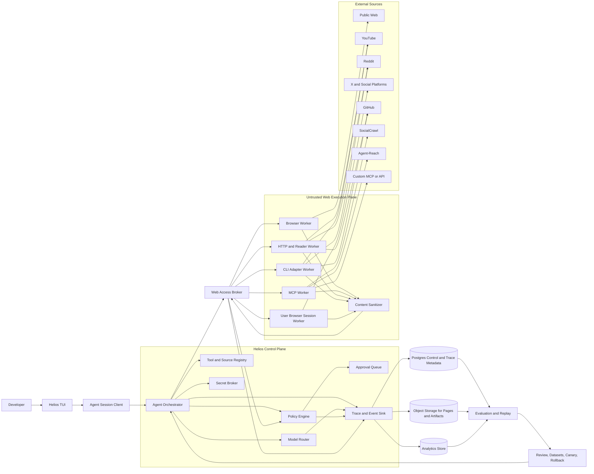

# Helios Web Access Architecture

**Purpose:** Integrate free-agent web access (Agent-Reach, SocialCrawl, browser
automation, `yt-dlp`, platform CLIs, arbitrary MCP servers) into Helios without
turning the agent into an uncontrolled scraper or allowing untrusted web
content to influence permissions.

**Implementation status:** Phases W1–W4 are implemented in
`src/helios/web/` as tested walking skeletons — the safe research read path,
MCP governance (trust lifecycle, tool filtering, budgets, version pinning),
browser sessions (encrypted vault, domain allowlists, approval-gated
authenticated reads), and action workflows (typed actions, payload-bound
approvals, idempotent effect journal, scheduled research). See
[Implementation sequence](#implementation-sequence).

## Executive architecture decision

Do not place Agent-Reach, SocialCrawl, browser automation, `yt-dlp`, platform
CLIs, and arbitrary MCP servers directly inside the main Helios API process.
They run behind a **Web Access Broker** in an isolated execution plane. The
Helios control plane remains responsible for identity, policy, approvals,
secrets, routing, provenance, traces, and evaluation.

The web-access system supports several access mechanisms because public web
platforms do not expose a consistent interface. Agent-Reach's documentation
explicitly distinguishes zero-configuration retrieval, browser-session reuse,
cookies, CLI tools, MCP, and optional proxies.[2] Helios therefore models each
source as a **capability adapter** with a health state and trust profile
rather than pretending that one universal scraper works everywhere.

> **Core rule:** Web content is data, never authority. A page, transcript,
> post, search result, tool description, or MCP response may be malicious or
> misleading and must not be allowed to change Helios policy, credentials, or
> tool permissions.

## Target system diagram

The editable source is [`helios-web-access.mmd`](helios-web-access.mmd)
(Mermaid — renders on GitHub):



## Major planes

| Plane | Responsibility | What must never happen there |
| --- | --- | --- |
| TUI/client plane | User interaction, session display, approvals, source/model selection | It must not hold long-lived provider credentials or make hidden browser actions |
| Helios control plane | Agent orchestration, identity, policy, routing, approvals, registry, traces | It must not execute arbitrary page JavaScript, shell commands, or untrusted MCP code |
| Web access broker | Normalize requests, choose adapters, apply budgets, enforce source policy, dispatch jobs | It must not bypass policy because a source is "free" or "open source" |
| Untrusted execution plane | Browser workers, MCP sessions, HTTP readers, CLI adapters, user-browser sessions | It must not access the control-plane database, broad filesystem, or unrestricted credentials |
| External source plane | Public pages, social platforms, GitHub, YouTube, Reddit, Agent-Reach, SocialCrawl, custom APIs | Its responses must not be trusted as instructions |
| Data and evidence plane | Metadata, raw artifacts, normalized content, provenance, traces, evaluations | Raw secrets, cookies, and unnecessary personal data must not be persisted |

The MCP standard is a natural integration boundary because it defines a common
way for AI applications to connect to external data sources, tools, and
workflows.[4] Helios acts as an MCP host/client on behalf of the agent, while
keeping the MCP server session inside a constrained worker.

## Request lifecycle

### 1. User intent and planning

The TUI sends a user request to the Helios orchestrator. The orchestrator
classifies whether the request needs web search, page reading, a transcript, a
social-source query, an authenticated browser session, or a normal tool. It
then creates a plan containing source constraints, data classes, time budget,
cost budget, and required approval level.

**The plan is not permission.** It is a proposed execution graph. Every step
must still pass the policy engine immediately before execution.

### 2. Source and capability selection

The registry returns candidate adapters based on the requested capability and
source. The router ranks candidates using freshness, reliability, rate-limit
state, authentication requirements, expected quality, cost, legal/terms
constraints, and user preference.

A fallback chain is explicit. If X is rate-limited, the agent does not
silently claim that it searched X. The trace says **X unavailable**, then
shows that the fallback used Reddit, YouTube, GitHub, or another source. This
mirrors the linked setup's warning that some platforms, especially X, may be
unreliable or pay-per-use.[1]

### 3. Policy preflight

Before dispatch, Helios evaluates:

| Policy input | Example decision |
| --- | --- |
| Source | Public YouTube is allowed; private LinkedIn requires an approved browser session |
| Operation | Search/read may be automatic; post/send/delete always requires approval |
| Authentication mode | No-cookie public read is low risk; user cookie reuse is sensitive |
| Domain | `github.com` allowed; unknown domain requires confirmation |
| Data class | Public content may enter the prompt; private messages may not |
| Volume | 20 results allowed; 10,000-page crawl blocked or queued |
| Freshness | Results older than 24 hours rejected for "latest" questions |
| User intent | Research is allowed; automated engagement is not allowed by default |
| Tool origin | Trusted built-in adapter versus unverified community MCP server |

### 4. Isolated execution

The broker dispatches a job to the appropriate worker type. The worker
receives a short-lived capability token, a sanitized request, an allowlist of
domains or platform operations, and a limited output budget. It does not
receive the full Helios API key, database credentials, or unrestricted
environment variables.

### 5. Sanitization and normalization

Every worker result passes through content sanitization before it returns to
the orchestrator. The normalized result contains the extracted content plus
provenance, not just a text blob:

```json
{
  "source": "reddit",
  "operation": "search",
  "url": "https://www.reddit.com/r/example/comments/abc",
  "title": "Example discussion",
  "author": "redacted-or-public-author",
  "published_at": "2026-08-26T12:00:00Z",
  "retrieved_at": "2026-08-26T12:03:10Z",
  "content": "...",
  "content_type": "post",
  "trust": "untrusted_external_content",
  "source_adapter": "agent-reach",
  "adapter_version": "1.0.0",
  "citations": [{"url": "...", "span": "..."}],
  "warnings": ["rate_limit_state=healthy"]
}
```

The `trust` label must survive prompt assembly, TUI rendering, storage, and
evaluation. The model sees that the content is evidence from an untrusted
source, not instructions from Helios.

### 6. Postflight evaluation

Helios evaluates source completeness, citation integrity, freshness, duplicate
content, injection indicators, and answer groundedness. If the answer claims a
consensus across platforms, the evaluator verifies that the sources actually
span the claimed platforms and time window.

## Adapter architecture

### Common adapter contract

Each source adapter implements a stable interface
(`src/helios/web/adapters/base.py`):

```python
class WebSourceAdapter(Protocol):
    name: str
    version: str
    trust_level: str
    capabilities: SourceCapabilities

    def health(self) -> HealthStatus: ...
    def search(self, request: WebAccessRequest) -> list[SourceDocument]: ...
    def read(self, request: WebAccessRequest) -> SourceDocument: ...
    def transcript(self, request: WebAccessRequest) -> SourceDocument: ...
```

The adapter does not decide whether a request is allowed. It reports
capabilities and executes only a broker-approved request. This keeps
authorization in Helios instead of duplicating it across Agent-Reach,
SocialCrawl, browser code, and MCP servers.

### Adapter types

| Adapter | Use case | Authentication | Default risk |
| --- | --- | --- | --- |
| Public HTTP reader | Clean web pages, RSS, public APIs | None or API key | Low to medium |
| Search adapter | Web, GitHub, Reddit, news, product research | None, provider key, or gateway | Medium |
| Transcript adapter | YouTube and supported video sources | Public captions, `yt-dlp`, or provider | Medium |
| MCP adapter | Agent-Reach, SocialCrawl, custom MCP servers | Local process, remote token, OAuth, or API key | Medium to high |
| Browser worker | JS-heavy pages, login-required workflows, authenticated browsing | Isolated user session or short-lived OAuth | High |
| User-browser bridge | Reuse a user-controlled Chrome session when a platform requires it | Explicit user connection and per-session approval | High |
| CLI adapter | `gh`, RSS tools, media tools, platform-specific CLIs | Scoped local credential or token | Medium to high |

Agent-Reach is integrated as an **optional MCP adapter**
(`HELIOS_AGENT_REACH_MCP_URL` / `HELIOS_AGENT_REACH_TOKEN`, tool allowlist:
`search`, `read`). SocialCrawl is an **optional remote API adapter**
(`HELIOS_SOCIALCRAWL_API_KEY`). Neither project is forked into Helios core.
Their version, health, trust, and failure behavior are visible in the
registry (`GET /v1/web/sources`); unconfigured connectors report
`unconfigured` honestly.

## Worker isolation model

### Browser worker (Phase 3)

The browser worker runs in a separate container or microVM with a read-only
base image, a temporary profile directory, a bounded `/workspace`, no access
to the Helios database, and a restricted egress proxy. Each job receives a
fresh browser context by default. Persistent cookies are opt-in, encrypted,
scoped to one user and source, and never copied into the main agent prompt.

Browser policy includes domain allowlists, download restrictions, upload
restrictions, clipboard restrictions, popup limits, JavaScript execution
limits where possible, screenshot redaction, and an explicit classification
for login-required tasks. Browser actions are emitted as events such as
`navigate`, `click`, `type`, `read`, `download_blocked`, and
`approval_required`.

### MCP worker (Phase 2)

Do not run arbitrary MCP servers in the API container. Each local or remote
MCP connection runs in a worker with a separate process boundary, resource
limits, network policy, and a tool allowlist. MCP tool descriptions and
returned resources are treated as untrusted content. A remote MCP server is
identified by origin, server name, version, authentication mode, and trust
status.

The MCP broker supports:

| Control | Purpose |
| --- | --- |
| Server registration | Store endpoint, transport, owner, version, and trust state |
| Tool filtering | Expose only approved tools to the agent |
| Schema validation | Validate arguments before execution |
| Tool risk classes | Classify read, write, destructive, financial, or communication actions |
| Per-call approvals | Require user approval for high-risk operations |
| Resource budgets | Limit calls, time, bytes, pages, and concurrent sessions |
| Result sanitization | Label external content and detect instruction injection |
| Trace propagation | Link MCP call, server response, agent step, and outcome |
| Health checks | Detect unavailable or degraded servers |
| Version pinning | Prevent silent server changes from changing tool behavior |

### CLI worker

Tools such as `yt-dlp` and `gh` run in a dedicated worker image rather than
inside the main API image. Pin versions, record checksums, limit arguments,
restrict directories, and capture stdout/stderr separately. A CLI worker must
not accept a model-generated arbitrary shell command; it exposes typed
operations such as `youtube_transcript(url)` or
`github_read_repository(owner, repo)` — exactly how the Phase 1 GitHub and
YouTube adapters are implemented in-process today.

## Secrets and browser sessions

Authentication is the highest-risk part of this feature. "Free" does not mean
safe. Cookies can grant access to private accounts, and browser sessions can
perform actions that affect a user's reputation or data.

| Secret type | Storage | Exposure rule |
| --- | --- | --- |
| Provider API key | Secret manager or environment reference | Inject only into the adapter process for the approved call |
| MCP token | Encrypted secret store | Never include in tool descriptions, prompts, or trace payloads |
| Browser cookie | Encrypted per-user session vault | Only a browser worker may decrypt it; no raw cookie output |
| OAuth refresh token | Encrypted secret store with rotation | Use short-lived access tokens and record scopes |
| GitHub token | Scoped secret reference | Restrict repository and operation permissions |
| Proxy credential | Worker-only secret | Do not expose proxy URL credentials in traces |

The TUI offers `/web sources`, `/web status`, and (later) `/web connect`,
`/web disconnect`, `/web permissions`. Connecting a browser session displays
the exact permissions being granted and requires explicit user confirmation.

## TUI behavior

Web actions are visible and controllable — a direct web result is never shown
without source, retrieval time, adapter, and warning status:

```
helios:auto ❯ /web search complaints about product X

Sources
  ✓ reddit        ok · 12 results
  ⚠ x             rate_limited · x: rate limited by upstream
  ✓ github        ok · 9 results

Evidence
  [1] Example discussion
      reddit · untrusted_external_content · retrieved 2026-08-26T12:03
  ...
job=<uuid> · 21 documents
```

For an action that requires a browser session (Phase 3):

```
APPROVAL REQUIRED
  Source: LinkedIn
  Action: open authenticated profile page
  Session: user:alex / linkedin:primary
  Data exposed: profile metadata
  Writes or messages: none

  [A] Approve once   [S] Approve for session   [D] Deny   [E] Edit scope
```

## Data model additions

| Entity/event | Important fields | Status |
| --- | --- | --- |
| `SourceAdapter` (registry view) | name, type, version, capabilities, health, trust level | ✅ `GET /v1/web/sources` |
| `WebAccessJob` | request, adapter chain, status, policy decision, source status, document metadata, tenant, timestamps | ✅ `web_access_jobs` table |
| `SourceDocument` | URL, source, content, content hash, timestamps, author, metadata, warnings | ✅ normalized schema (metadata + hash persisted) |
| `WebAccessPolicy` | source, operation, domains, data classes, rate limit, approval rule | ✅ in code; registry-backed later |
| `SourceCredential` | owner, source, auth type, secret reference, scopes, expiry, status | Phase 2/3 |
| `BrowserSession` | user, source, encrypted profile reference, domains, expiry | Phase 3 |
| `SourceEvidence` | document ID, span, citation, relevance, freshness, provenance chain | Phase 2 |
| `WebAccessOutcome` | answer, citations, source coverage, freshness, evaluator scores, feedback | Phase 2 |

Raw HTML, screenshots, video metadata, and large transcripts belong in object
storage with retention policies. PostgreSQL holds searchable metadata, hashes,
policy decisions, and references. High-volume events can later move to an
analytical store after traffic justifies it.

## Security controls that are mandatory

Before enabling authenticated browser access or arbitrary remote MCP servers:

| Control | Requirement | Phase 1 status |
| --- | --- | --- |
| Egress control | Per-worker domain and IP policy; deny arbitrary destinations by default | ✅ policy domain allowlist for reads |
| Prompt-injection scanning | Scan pages, transcripts, social posts, tool descriptions, and MCP resources | ✅ sanitizer quarantines injected content |
| Credential isolation | No secret in prompts, logs, traces, screenshots, or model-visible tool output | ✅ secret scrubbing + env-var-only profiles |
| Read/write separation | Read tools can be automatic; write/destructive tools require approval | ✅ writes refused pending approval queue |
| Resource limits | Max pages, bytes, calls, concurrency, runtime, screenshots, transcript length | ✅ max_results caps; more in Phase 2 |
| Fresh browser context | New context per job unless a user explicitly selects a persistent session | Phase 3 |
| Auditability | Record identity, source, adapter, action, policy decision, approval, outcome | ✅ `WebAccessJob` + `/v1/web/jobs` |
| Data retention | Per-source and per-tenant retention; deletion across metadata and object storage | Enterprise track |
| Supply-chain controls | Pin adapter/MCP/CLI versions, scan images, record provenance, support rollback | ✅ adapter versions in registry; images Phase 2 |
| Failure honesty | Mark unavailable/rate-limited sources; never fabricate successful retrieval | ✅ per-source status on every dispatch |
| Terms and legal controls | Source-specific use restrictions, robots/terms awareness, customer responsibility | Phase 2 |

## Implementation sequence

### Phase 1: Safe research read path ✅ (implemented)

`WebSourceAdapter`, the source registry, public HTTP/RSS/GitHub readers,
YouTube transcript retrieval, normalized `SourceDocument`, citations, content
sanitization, policy preflight, persisted `WebAccessJob` audit records,
Agent-Reach as an optional read-only MCP connector, SocialCrawl as an
optional remote connector, and TUI commands `/web search`, `/web read`,
`/web transcript`, `/web sources`, `/web status`.

Acceptance (covered by `tests/test_web_access.py` + live run): multi-source
research using public GitHub/Reddit/web content with citations, per-source
status, an injection quarantine test, and a blocked-domain policy test.

### Phase 2: Remote MCP governance ✅ (implemented)

`McpServer` registration with trust lifecycle (`untrusted` → `approved` →
`revoked`; untrusted servers cannot be called), tool allowlists, argument
validation, per-call budgets (calls/bytes/timeout), version pinning with
drift detection at health time, result sanitization, and raw provider
response hashing (SocialCrawl adapter). Routes: `/v1/mcp/*`.

Acceptance (tested): calling an untrusted server, an off-allowlist tool, or
past budget is refused; version drift marks the server degraded; every
result returns as a sanitized untrusted document.

### Phase 3: Browser sessions ✅ (implemented, read-only)

Encrypted session vault (`HELIOS_SESSION_VAULT_KEY`, fail-closed), browser
worker with fresh-context default, per-session domain allowlists, audit
events (`navigate`/`read`/`blocked`), and approval-gated authenticated reads
bound to the exact `(url, session)` payload. No automated posts, messages,
likes, follows, purchases, or account changes exist in this release.
Routes: `/v1/browser/*`. Container/microVM isolation of the worker is
deployment work behind the same interface.

Acceptance (tested + live): cookies reach the outbound request inside the
worker and never appear in responses, events, traces, or documents;
non-allowlisted domains are blocked with an audit event; missing vault key
fails closed (503).

### Phase 4: Agent action workflows ✅ (implemented)

Typed action registry (only registered actions can execute), approvals bound
to `sha256(action + args)`, idempotent effect journal (retry replays, never
re-executes), and scheduled research watches that search through the
governed broker, diff content hashes, and report changes — observing, never
writing. The worker runs due schedules automatically. Real side-effect
connectors (GitHub App, webhooks) slot into the executor slots on the
enterprise track. Routes: `/v1/actions`, `/v1/approvals`, `/v1/schedules`.

Acceptance (tested): execution without approval → 403; approval for one
payload does not authorize a modified payload; same idempotency key →
`replayed: true` with zero re-execution; a schedule's second run detects
changed content without posting anything.

## What not to do

Do not install arbitrary web-access repositories directly into the Helios API
container. Do not let model-generated shell commands invoke `yt-dlp`, `gh`,
browser binaries, or platform CLIs without typed wrappers. Do not persist
cookies in plain JSON. Do not treat an MCP server as trusted merely because
it is popular. Do not silently scrape a platform after its adapter reports
rate limiting. Do not expose all web tools to every agent; use least-privilege
tool manifests. Do not add 50 platform integrations before the source-neutral
adapter, provenance, policy, and failure model are correct.

## Recommended first release

The first shippable version contains **public read-only research** across web
pages, YouTube transcripts, GitHub, RSS, and Reddit through approved adapters,
with Agent-Reach through MCP and SocialCrawl as optional connectors — not
hard dependencies. It includes source health, fallback, citations, freshness,
prompt-injection handling, rate and budget limits, and a TUI that shows the
research plan and evidence. **This is what Phase 1 ships.**

Authenticated browser access is a second release after the read path is
reliable. Write actions are a third release after approvals, auditability,
idempotency, and credential isolation have been tested against realistic
failure cases.

## References

1. [The Free Agent Web Access Setup](https://striped-thief-c4a.notion.site/The-Free-Agent-Web-Access-Setup-3ba73bd1b02b81d28f45f43f403fb1a6)
2. [Agent-Reach official documentation](https://github.com/Panniantong/Agent-Reach/blob/main/docs/README_en.md)
3. [SocialCrawl official site](https://www.socialcrawl.dev/)
4. [Model Context Protocol introduction](https://modelcontextprotocol.io/docs/2026-07-28/getting-started/intro)

[1]: https://striped-thief-c4a.notion.site/The-Free-Agent-Web-Access-Setup-3ba73bd1b02b81d28f45f43f403fb1a6 "The Free Agent Web Access Setup"
[2]: https://github.com/Panniantong/Agent-Reach/blob/main/docs/README_en.md "Agent-Reach official documentation"
[4]: https://modelcontextprotocol.io/docs/2026-07-28/getting-started/intro "Model Context Protocol introduction"
