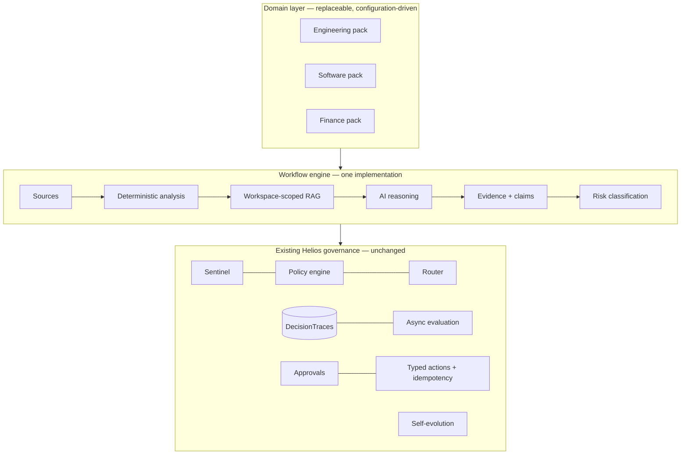

# Helios Workflow Layer — Domain-Adaptable Governed AI Operations

> **One governed AI runtime. Multiple enterprise workflows.**
> **The domain changes. The governance does not.**

The workflow layer turns Helios into an extensible governed AI operations
layer that adapts to different enterprise domains while preserving a common
architecture for knowledge, reasoning, evidence, evaluation, policy,
approval, action, and audit.

It is an **additive extension**: every workflow execution runs through the
existing Helios gateway internals — Sentinel scans, the policy engine, the
model router with fallback, DecisionTraces, async evaluation, the approval
system, the idempotent action journal, and the knowledge graph. There is no
parallel execution or security path.

## Architecture



The reusable pipeline each execution follows:

```
SOURCE → INGESTION → NORMALIZATION → CONTEXT/RETRIEVAL
  → DETERMINISTIC ANALYSIS → AI REASONING → EVIDENCE + PROVENANCE
  → EVALUATION → POLICY → RECOMMENDATION → RISK CLASSIFICATION
  → HUMAN APPROVAL (when required) → TYPED ACTION → IDEMPOTENT EXECUTION
  → DECISION TRACE → OUTCOME → FEEDBACK → EVALUATION / IMPROVEMENT
```

## Core models

| Concept | Where | Notes |
|---|---|---|
| Workspace | `WorkspaceConfig` (`workflows/types.py`) | id, name, domain, terminology, sources, capabilities, workflows, policies, actions, risk config, system instructions, metadata — pure configuration |
| Workflow | `WorkflowDefinition` | input schema, source requirements, retrieval config, analysis steps, reasoning config, risk rules, approval config, output schema |
| Pack | `WorkspacePack` | config + deterministic analysis callables + synthetic seed data |
| Source | `WorkspaceSource` (DB) | tenant + workspace scoped; structured `record` JSON and/or text; provenance; **explicit trust classification** |
| Execution | `WorkflowExecution` (DB) | facts, evidence, claims, interpretation, recommendation, risk, confidence, evaluation, feedback, trace_id |
| Evidence | `Evidence` | kind (computation/record/document), source, reference, excerpt, trust, score, timestamp |
| Claim | `Claim` | claim text, **reasoning category** (fact/computation/interpretation/recommendation), evidence refs, confidence, timestamp |

### The fact/interpretation boundary

The LLM is never the source of truth for arithmetic:

```
COMPUTED FACT      max_temp_c: 48.2 -> 61.3 (+27.18%)      ← deterministic code
AI INTERPRETATION  the latest run shows increased thermal   ← model, grounded in
                   stress                                      the facts block only
RECOMMENDATION     risk classified high; engineering review ← config-driven risk
                   requires human approval                     rules + approval gate
```

If no sources match, the engine returns **`insufficient_evidence`** with
confidence 0.0 and no AI call at all — it never fabricates sources,
citations, calculations, or confidence.

## Governance integration (what is reused, not rebuilt)

| Stage | Existing Helios system used |
|---|---|
| Authentication / tenancy | API keys, tenant_id filters on every query |
| Retrieval | Existing RAG (`retrieval.search`) with an added `workspace_id` filter applied **before** distance calculation |
| Input safety | `sentinel.detect_pii` / `detect_injection`; PII redaction before external providers |
| Poisoned documents | Retrieved chunks with injection patterns dropped (same defense as the gateway) |
| Policy | `policy.preflight` — same allow/redact/deny gates; blocked runs persist `status=blocked` traces |
| Model calls | `registry.select_route` + provider fallback chain |
| Audit | One `DecisionTrace` per run (`task_type="workflow:<id>"`) with workspace context, facts, policy record, routing, cost, latency |
| Async evaluation | Same `EvaluationJob` queue and worker |
| Approvals | Existing `ApprovalRequest` with payload-hash binding (`sha256(action+args)`) |
| Actions | Existing typed registry + `ActionEffect` idempotency journal (packs register actions via `register_action`) |
| Review queue | Negative feedback escalates to existing `ReviewItem`s |
| Self-evolution | Workflow failures become mining signatures (`workflow_insufficient_evidence:*`, `workflow_negative_feedback:*`) → typed proposals → human gate |
| Knowledge graph | Existing `Entity`/`Relationship`, extended with entity→entity domain edges with provenance |

## Risk model

Risk levels: `informational · low · medium · high · critical`.

Each workflow declares a `base_risk` plus config-driven `risk_rules`
evaluated over computed facts (e.g. `threshold_violations nonzero → high`).
Informational analysis completes automatically. When the classified risk is
in the workflow's `approval.required_for` set, the execution is marked
`requires_approval` and the consequential follow-up must go through:

```
POST /v1/workflows/executions/{id}/propose-action   → ApprovalRequest (typed action)
POST /v1/approvals/{id}/decide                      → human decision
POST /v1/actions/execute                            → payload-bound, idempotent
```

`LLM → arbitrary external action` does not exist anywhere in the system.

## Reference workspaces (all data synthetic)

### Engineering (primary reference)

Synthetic storyline: Test Run 104 (module BM-2000) → thermal anomaly →
maintenance ME-12 (coolant pump P-7) → incident INC-7 → historical incident
INC-3; Test Run 105 runs with degraded cooling flow.

| Workflow | Deterministic core | Escalation |
|---|---|---|
| `test_run_comparison` | abs/% changes across 7 parameters, configured threshold checks | violations → high → engineering review approval |
| `incident_investigation` | related incidents/maintenance/runs by component | recurrence → high; "potential contributing factor" language enforced in prompt |
| `daily_brief` | severity-rule aggregation (critical/important/informational/requires_review) | open incidents → critical |
| `knowledge_assistant` | — | grounded Q&A over SOPs/manuals with citations |

### Software Engineering

Fixtures: deployments 41 (success) / 42 (failed at db-migration), commits
c4d5/e6f7, incidents SW-INC-19/23, architecture + rollback docs.
Workflows: `deployment_failure_investigation` (commit diff between last
success and failure + CI error extraction), `release_risk_analysis`
(change size, missing tests, incident-prone services), `daily_brief`.
Live GitHub/web data remains available via the existing governed web
access plane.

### Finance / Operations

Fully synthetic invoices/vendors + a config-driven procurement policy
(PO required > $5k, approval > $25k, registered vendors only, duplicate
detection). Workflows: `invoice_compliance_review`, `operations_brief`.
**No autonomous financial transactions exist** — the only typed action is
`flag_invoice_for_review`.

## API

```
GET  /v1/workspaces                          list workspaces
GET  /v1/workspaces/{id}                     full workspace configuration
GET  /v1/workspaces/{id}/workflows           workflow definitions
POST /v1/workspaces/{id}/seed                load synthetic demo data (idempotent)
POST /v1/workspaces/{id}/sources             add a source (trust classified)
GET  /v1/workspaces/{id}/sources             list sources (tenant isolated)
GET  /v1/workspaces/{id}/overview            command-center view
POST /v1/workflows/run                       execute a governed workflow
GET  /v1/workflows/executions[?workspace_id] history
GET  /v1/workflows/executions/{id}           full result (facts/evidence/claims)
POST /v1/workflows/executions/{id}/propose-action   typed follow-up via approvals
POST /v1/workflows/executions/{id}/feedback  useful|incorrect|incomplete|unsafe|irrelevant
```

Existing endpoints are reused for approvals (`/v1/approvals`), execution
(`/v1/actions/execute`), traces (`/v1/traces`), review (`/v1/review/queue`),
and evolution (`/v1/evolution/*`).

## TUI

```
/workspace list | use <id> | status
/workflow  list | run <id> [k=v ...] | history
/brief
/evidence <execution-id>
```

Every run prints the governance banner:

```
GOVERNED
  WORKSPACE : ENGINEERING
  WORKFLOW  : TEST_RUN_COMPARISON
  STATUS    : COMPLETED
  TRACE     : 4264edad-…
  RISK      : HIGH
  EVIDENCE  : 14 SOURCES
  CONFIDENCE: 0.9
  APPROVAL  : REQUIRED
```

## Demo

```bash
make demo          # or: PYTHONPATH=src python -m helios.cli demo
```

Initializes all three workspaces with synthetic data for tenant `demo`,
runs one example workflow per workspace, and prints an API key plus TUI
commands. Runs on SQLite + the mock provider — no external services, no
secrets, no proprietary data.

## Extending Helios to a new domain

Adding a fourth domain requires **configuration and a domain module**, not
core changes:

1. **Create a pack module** (`src/helios/workflows/packs/<domain>.py`) with a
   `WorkspaceConfig` (id, terminology, source types, system instructions).
2. **Add workflows** as `WorkflowDefinition`s: input schema, source types,
   retrieval config, analysis step names, reasoning template, risk rules,
   approval config.
3. **Write deterministic analysis steps** — pure functions
   `(input, sources, workspace) -> {"facts": [Fact...], "tables": {...}}` —
   composing helpers from `workflows/analysis.py`.
4. **Add a source** at runtime via `POST /v1/workspaces/{id}/sources`
   (structured `record` and/or text; external content gets
   `untrusted_external_content`), or seed data on the pack.
5. **Add a policy** as pack `policies` config consumed by your analysis
   steps (like the finance procurement policy), plus `risk_rules` for
   escalation. Gateway-level policy (PII, injection, output gates) applies
   automatically.
6. **Add an action** as an `ActionSpec` on the pack — it registers into the
   existing typed-action registry with approval binding and idempotency.
7. **Add evaluation** expectations via the workflow's `output_schema` /
   `require_sources`; workflow-level scores (evidence count, citation
   coverage, policy compliance, insufficient-evidence rate) are recorded
   automatically, and traces flow through the existing async evaluators.
8. **Register the pack** in `workflows/registry.py` (or call
   `register_pack` at startup).

The engine source contains no domain terms — verified by a test that greps
it for industry vocabulary.

## Evaluation

Explicit, meaningful measures stored on each execution and mined from
traces (no invented "AI accuracy" metrics):

`computed_fact_count · evidence_count · citation_count · retrieval_used ·
dropped_poisoned_chunks · policy_compliant · structured_output_valid ·
model_declined_insufficient_evidence · risk · latency_ms · cost_usd`
plus the existing async evaluator suite (empty output, latency SLA,
refusal, groundedness/hallucination risk) and human-review rate via the
review queue.

## Limitations (honest)

- Demo interpretations use the **mock provider** (echo) by default; real
  model output requires configuring a provider (free tiers supported).
  The deterministic facts, evidence, risk, and governance are fully real.
- Confidence is a deterministic evidence-coverage heuristic, not a
  calibrated probability.
- Workspace packs are Python-module configuration; a JSON/YAML pack loader
  is a straightforward next step on the same `WorkspacePack` schema.
- All demo data is synthetic and labeled as such. **No production-readiness
  claim is made for regulated environments.**
